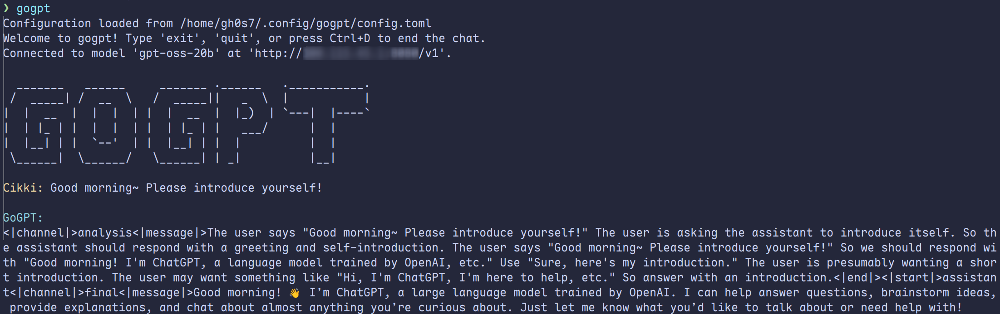

# gogpt

A simple and lightweight command-line interface (CLI) for interacting with a chat-based Large Language Model (LLM). It is written in Go and provides a straightforward way to chat with a compatible AI model directly from your terminal, with support for streaming responses.



## Features

-   **Interactive Chat:** Engage in a conversation with an AI model from your terminal.
-   **Streaming Support:** Receives and prints AI responses token-by-token for a real-time experience.
-   **Configuration First:** On first run, it helps you create a configuration file.
-   **Conversation History:** Maintains the context of the current conversation.
-   **Cross-platform:** Works on Linux, macOS, and Windows.

## Getting Started

### Prerequisites

-   Go 1.18 or higher.
-   Access to an OpenAI-compatible API endpoint.

### Installation and Usage

1.  **Clone the repository:**
    ```bash
    git clone https://github.com/user/gogpt.git
    cd gogpt
    ```

2.  **Run the application:**
    ```bash
    go run main.go
    ```

    On the first run, `gogpt` will prompt you to create a configuration file located at `~/.config/gogpt/config.toml`.

## Configuration

`gogpt` requires a configuration file to connect to the AI model. You will be prompted to create one on your first run. The configuration is stored in TOML format.

Here is an example `config.toml`:

```toml
# The base URL of the API endpoint (e.g., http://localhost:8080/v1)
api_endpoint = "http://127.0.0.1:8080/v1"

# Your API key (optional, leave blank if not needed)
api_key = ""

# The model name to use for the chat
model = "gpt-oss-20b"

# Your name to be displayed in the chat prompt
username = "User"
```

## Building from Source

You can also build the executable and place it in your `PATH`.

```bash
# Build the binary
go build -o gogpt

# Move the binary to a location in your PATH (e.g., /usr/local/bin)
# On Linux/macOS:
sudo mv gogpt /usr/local/bin/

# On Windows (using PowerShell as Administrator):
# Move-Item -Path .\gogpt.exe -Destination C:\Windows\System32
```

Once built and moved, you can run the application from anywhere by simply typing `gogpt`.
